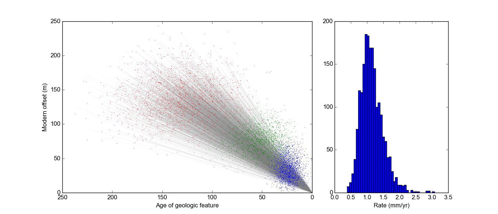
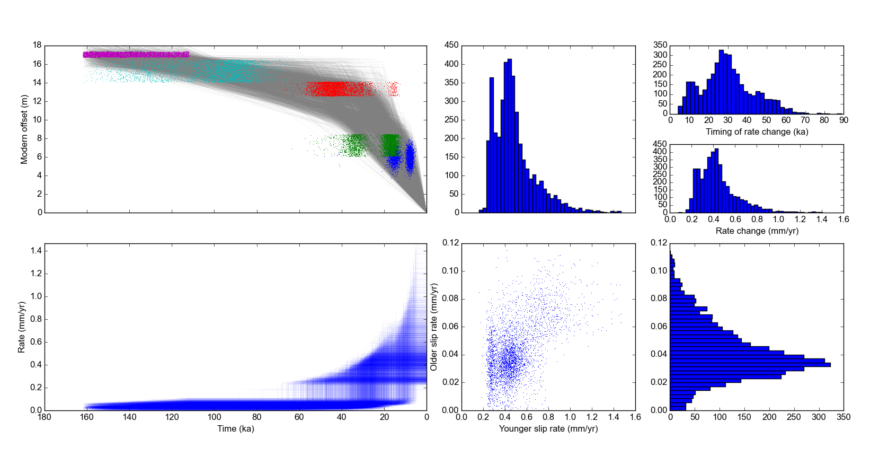
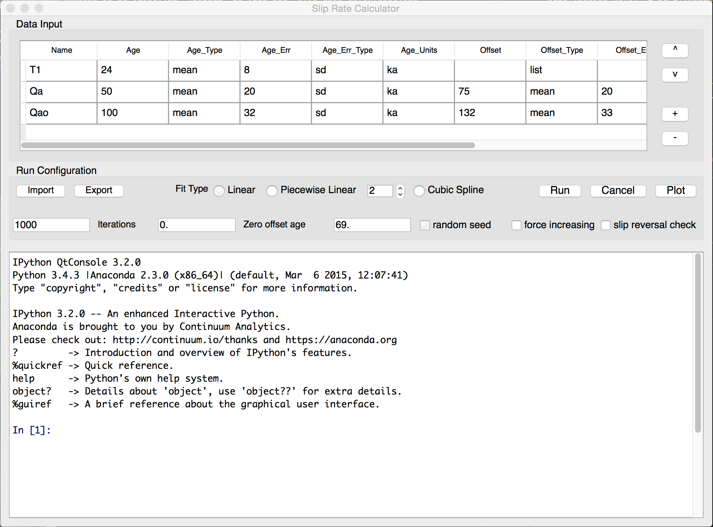

Slip Rate Calculator
====================

The Slip Rate Calculator is a tool that takes probability distributions for age
and offset distance for geologic (or other) features cut by a fault and
calculates the probability distribution of the fault's slip rate via Monte
Carlo methods. The idea is to use empirical estimates of the probability of
the ages and offsets directly from field observations and analytical measurements,
rather than canned PDFs (uniform, Gaussian, etc.), when possible. It's not always,
though, so some canned PDFs are supported.

Typically, the offset features (called `offset markers`) show
*cumulative offset*, i.e. all the `offset markers` that are present on a fault
at a given time interval experience the same offset amount over that time.



The Slip Rate Calculator can also calculate slip rates that change through
time, either by fitting a piecewise line (with a specified number of segments)
or a cubic spline. The piecewise fitting routine also includes a statistical
test (based on the [Bayesian Information Criterion][bic]) to determine whether
there was a slip rate change at some point in the past.




[bic]: https://en.wikipedia.org/wiki/Bayesian_information_criterion

The Slip Rate Calculator is [MIT licensed](LICENSE.txt).

## Installation
The Slip Rate Calculator is a Python 3 application. It depends heavily on the
core Python scientific stack, as well as PyQt4. The easiest way to get
everything running is to install the free [Anaconda Python 3.4][anaconda]
scientific Python distribution. It doesn't interfere with your system Python,
or any other Python versions you may have on your computer.

[anaconda]: https://store.continuum.io/cshop/anaconda/

Then, the git repository should be cloned:

```
git clone https://github.com/cossatot/slip_rate_calculator.git
```

The Slip Rate Calculator (which does need a more clever name) itself doesn't
need to be installed. Instead, go into the `slip_rate_calculator/app`
directory and run `python SlipRateGUI.pyw` or `./SlipRateGIU.pyw`.

Note: Because the Slip Rate Calculator has an embedded IPython console, it
can't be run using IPython.

### Dependencies
The actual calculator uses `numpy`, `scipy` and `pandas` in addition to the
standard Python library. The GUI uses `PyQt4` and `IPython` as well. It may
work with Python versions other than 3.4 (e.g. 2.7) but has not been tested.

## Basic Theory
None right now. Total scientific nihilism.

## Basic Usage

Using the Slip Rate Calculator is fairly simple, at least relative to
collecting the data. The GUI has three components: An interactive table for
data entry, a box with various field and buttons and stuff for configuring and
running the calculations, and an IPython console at the bottom.



Basically, the data and metadata for each `offset marker` should be added to
the table, then the options for the run configuration should be set, and then
the `Run` button should be pressed. Once the run is finished, some results
and statistic will be displayed in the IPython console at the bottom. At this
time, the user can hit the `Plot` button and plots of the results will appear.

All data and run configuration settings can be imported, modified (in or out
of the GUI) and exported; settings are stored internally as Python `dicts`
and externally as [`JSON`](https://en.wikipedia.org/wiki/JSON) files.
This is really helpful for reproducing the runs, as well as entering long
lists of numbers (for arbitrary PDFs of age or offset).

Though the IPython console is interactive and fully featured, nothing needs to
be typed into it.

### Data Entry

This is a table where the `offset markers` are added. Each row is an `offset marker`.
There are 11 fields for each offset marker: 1
for the name, and then 5 for the age data and 5 for the offset data. The fields
for age and offset are very similar, differing mainly in their units.

The fields can be added or deleted with the `+` and `-` buttons. The data should
be layed out in youngest (top) to oldest (bottom) order. Eventually the `^` and `v`
buttons will allow the rows to be moved around but that isn't implemented yet.


Field  | Data type       |  Units  | Options | Example
-------|-----------------|---------|---------|--------
`Name`  | String         | (none)  | (none)  | `T1`
`Age`   | Numeric        | time    | Number or list of numbers | `10` or `[23.,27.5,29.2]`
`Age_Type` | String      | (none)  | `mean`, `median`, `list` | `median`
`Age_Err` | Numeric      | time    | Number or list of numbers | `7` or `[0., 0.53, 0.2]`
`Age_Err_Type` | String  | (none)  | `sd`, `mad`, `minmax`, `probs` | `minmax`
`Age_Units` | Numeric    | time    | `ka` (for now) | `ka`
`Offset` | Numeric       | distance| Number or list of numbers |`10` or `[23.,27.5,29.2]`
`Offset_Type` | String   | (none)  | `mean`, `median`, `list` | `list`
`Offset_Err` | Numeric   | distance| Number or list of numbers | `7` or `[0., 0.53, 0.2]`
`Offset_Err_Type` |String| (none)  | `sd`, `mad`, `minmax`, `probs` | `probs`
`Offset_Units` | String  | distance|`m` (for now)  | `m`

#### Explanations:
`Name` : The name of the `offset marker` (typically the geologic unit or other descriptor)

`Age` : The age of of the `offset marker`. If this is a single value, it is the 'central'
or most-likely age (`mean` or `median`). If this is a range of values, it needs to be of
`Age_Type`==`list` and the `Age_Err` also needs to be a list of the same length. 

`Age_Type` : What the value in the `Age` field represents.

`Age_Err` : The error (uncertainty) of the `Age` measurements. Needs to be the same length
as `Age`; i.e. if `Age` is a scalar, then `Age_Err` does too, and if `Age` is a list,
then `Age_Err` needs to have the same number of elements.  If these are lists, `Age_Err`
is the *scaled probability* of the corresponding element in the `Age` list. These probabilities
are basically on the same arbitrary and don't have to add up to 1 or any other value; they could
all be on a 0-10 scale or whatever. 0 always means 0 though.

`Age_Err_Type` : The type of uncertainty given by the `Age_Err` field. This can be
`sd` for the standard deviation (to be used with `Age_Type`==`mean`), `mad` for the
median absolute deviation (to be used with `Age_Type`==`median`), `minmax` for
the half-width of a uniform distribution (where the center of the distribution is
specified by the `Age`, with `Age_Type`==`mean`).

`Age_Units`: This should be self-explanatory.  Currently the everything is in thousand
years (`ka`).  Later, other units will be allowed.

Offset fields are exactly the same as ages. 

##### Choosing and specifying PDFs
*Arbitrary PDFs*

This is one of the major reasons for using this tool instead of others. Most of the time,
the best estimates for the probablity distributions of the age or offset of an `offset marker`
are *not* uniform or Gaussian PDFs. The offsets should be empirically specified based on mapping,
trenching or remote sensing, using the geologist's knowledge and intuition. The ages
should come directly from analytical measurements (or the like) and may also be truncated
by cross-cutting relationships or whatever other constraints.

To use an arbitrary PDF, you want ot make a list of *x* values and a list of *y* (or *p*(*x*))
values. For a trapezoid of offset values, you can do something like this:

`Offset = [3., 5., 9., 9.01]`

`Offset_Err = [0., 4., 4., 0.]`

which would correspond to a PMF that looks like this:
```
4      *-------*
3     /        |
2    /         |
1   /          |
0  *           *
   3 4 5 6 7 8 9
```

In this case, the `Offset_Type` should be `list` and the `Offset_Err_Type` should be `probs`.

*Standard PDFs*

For a uniform PDF, use a scalar `Age` or `Offset` value, `Age_Type` or `Offset_Type`
set to `mean`, `Age_Err` or `Offset_Err` set to the distance between the middle (mean)
and either side of the PDF (i.e. half the uniform PDF width), and the `Age_Err_Type`
or `Offset_Err_Type` to `minmax`.

For a Gaussian PDF, use a scalar `Age|Offset` value, `Age|Offset_Type`==`mean`, a scalar 
`Age|Offset_Err` value,
and `Age|Offset_Err_Type`==`sd` (standard deviation). Because you do not have a time machine for
fieldwork, the Gaussian PDFs for `Age` will be truncated at 0, meaning no ages from the future
will be allowed. Offsets are allowed to have negative tails, as uncertainty in slip direction
is somewhat more common than rocks from the future.

For a Laplacian PDF (should you require one), use a scalar `Age|Offset` value, 
`Age|Offset_Type`==`median`, scalar `Age|Offset_Err`, and `Age|Offset_Err_Type`
to be `mad` (Median Absolute Deviation). Trimming of negative ages isn't currently
implemented, mostly because of disuse.


### Run Configuration
This is pretty straightforward.

#### Fit Type
Options are `Linear`, `Piecewise Linear`, or `Cubic Spline`.

`Linear` fitting is simply a least-squares regression line through each set (iteration)
of samples from the data.

`Piecewise Linear` is a continuous set of line segments that fit the data. Each adjacent
pair of line segments is separated by a *breakpoint*, when the slip rate change occurs.

Mathematically, the number of linear segments is constrained to be equal or smaller than the
number of data points (not counting the `zero_offset` point). This number is set in the
field to the right of the `Piecewise Linear` button. Currently, only two points
are supported. The fitting algorithm itself doesn't have this constraint, but the plotting
and some other statistics functions are not yet as flexible.

The `Piecewise Linear` fitting is a nonlinear problem and is substantially (~25x) slower than
the `Linear` fitting. Nonetheless, it is still reasonably fast.

`Cubic Spline` fitting is not implemented yet, but is basically an exact spline-based
fit to the data. Because splines can fit exactly, there is no error associated with the
splines. They're perfect! So this will have some different uses, for example tying
geodetic, neotectonic and geologic data over different orders of time and displacement
magnitude, where the data are sparse and widely-spaced enough that no linear
fit is required or expected to fit.

#### Run Settings

`Iterations`: This is how many Monte Carlo iterations are done. In each iteration,
an age and an offset is sampled from the constructed PDFs, and a line is fit.
Depending on the complexity of the system and the desired type of fit, somewhere
between 1000 to 10,000 iterations is useful and quick (a second to a minute on a
modern computer). For publication, 100,000 iterations will probably be on the
overkill side of acceptable. (Note that some of the runs will produce too bad of fits
and will be rejected, especially with `Piecewise Linear` fitting).

`Zero offset age`: This is the (younger) age at which no offset occurs.  I.e. for an
active fault, it would be 0. For a Cretaceous fault, it could be 60,000 (data in ka).
Currently no uncertainty used in this estimate, although this will change in the future.

`Random Seed`: This is an option to set a 'random seed', which is a value used to
get a predictable sequence of pseudorandom numbers. The reason for doing this is that
it makes Monte Carlo simulations and other stochastic or random-number based methods
completely reproducible. Note that for our purposes, these pseudorandom numbers are
definitely random enough for statistical robustness. This option is set through a
check box, and a numerical value to be used is typed in the field.

`Force increasing data`: This ensures that the ages and offsets for each iteration are
monotonically increasing.  It does *not* ensure that the best-fit rates will be
everywhere positive, although it strongly increases the likelihood of this.

`Allow slip reversals`: This box allows the sign of the slip rate to change. It defaults to `False`.


#### Importing and exporting
There are two buttons that do this exactly. They open up `File Open`-type dialongs that
allow you to input or export (save) a `JSON` file that has all of the data and the run
configuration.


### Intermediate Usage
For users with some knowledge of the Python data stack, once the data are input and run
for the first time, the user can type commands to do different analysis, make new plots,
and whatnot through the IPython interface. 

One feature of the embedded IPython console is that all of the GUI commands for running
and plotting are done through the IPython interpreter instead of the Python interpreter
in the background that runs the GUI: all of the buttons and so forth directly send text
commands to the IPython interpreter. This makes it so that the user can read the exact
commands that were sent, modify them, learn from them, etc. Additionally, the
`slip_rate_tools` module that does the real science can be called directly, and has
text completion and docstrings exposed.

### Advanced Usage
All of the scientific functionality is implemented through the `slip_rate_tools` module
that is packaged with the Slip Rate Calculator. This module is poorly documented at
present, but it can be imported and used in other scripts, programs, etc. to do
lots of different tasks.

Functionality includes:
- Creation and sampling of PDFs for age and offset based on the input data fields,
  including things like multi-dimensional PDFs of offset on multiple features, 
  accounting for conditional probabilities imposed by cross-cutting relationships
  or monotonically-increasing offset with age requirements.
- Linear, piecewise-linear, and spline fitting of age/offset pairs (or other xy data).
- Probably some other stuff.

Most of this functionality is exposed through the GUI but it could be used differently
for different use cases. For example, one could use an iterative fitting to refine PDFs
of offset on a feature based on how well the fit for the whole system fits that
particular offset marker.

Additionally, some slightly different fitting algorithms could be used based on
different use of the fitting functions; they are quite modular and could be used
creatively based on different needs or information (i.e. breakpoints could be fixed
for piecewise regression quite easily).

## Forthcoming Features
- [ ] Spline fitting of `offset markers`
- [ ] KDE estimates of Age or Offset from lists of values (probabilities internally generated).
- [ ] Automatic unit conversion
- [ ] Log/Log fitting (helpful for geodetic through geologic slip histories)
- [ ] Webapp (!!!)
- [ ] Sliders on rate/time and offset/time plots to get PDFs at any time

See [Issues](https://github.com/cossatot/slip_rate_calculator/issues) to browse or suggest
others. Suggestions are quite welcome!
